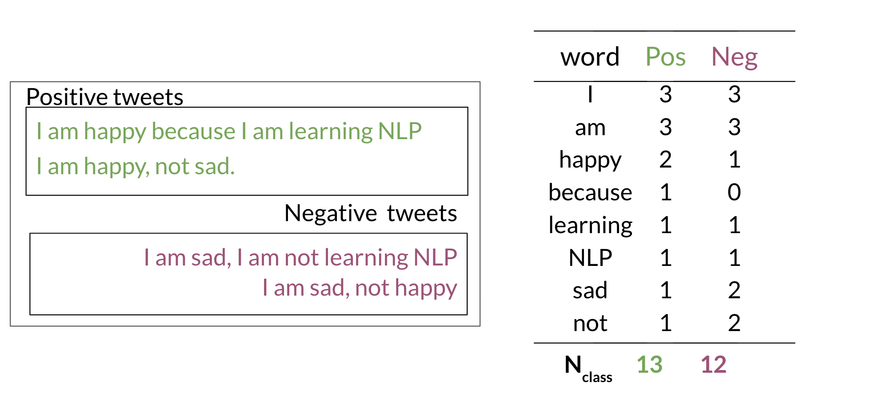
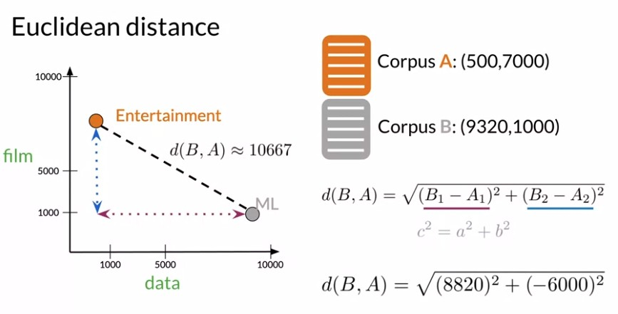
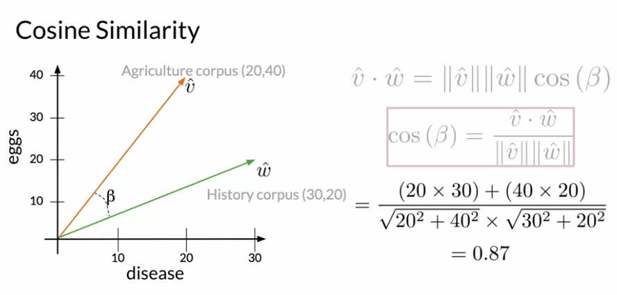
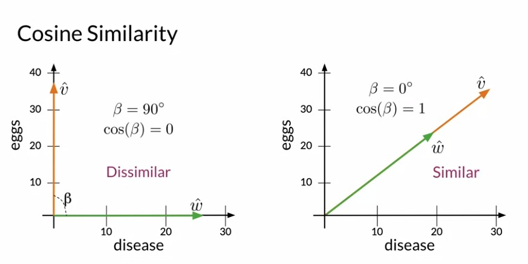
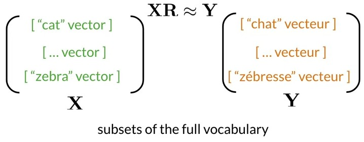
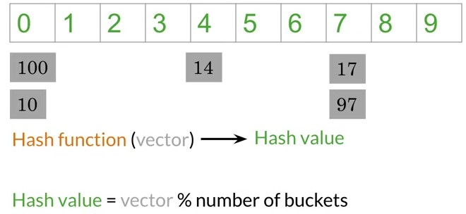

# Course 1: Natural Language Processing with Classification and Vector Spaces
This is the first course of the Natural Language Processing specialization at [Coursera](https://www.coursera.org/programs/educational-flag-learning-program-0tkxi?currentTab=MY_COURSES&productId=_U5cASTxEemuhAoKFebZeA&productType=s12n&showMiniModal=true) which is moderated by [DeepLearning.ai](http://deeplearning.ai/).

## Table of contents
* [Course 1: Natural Language Processing with Classification and Vector Spaces](#course-1-natural-language-processing-with-classification-and-vector-spaces)
   * [Week 2: Naive Bayes](#week-2-naive-bayes)
      * [Conditional probabilities](#conditional-probabilities)
      * [Bayes’ Rule](#bayes’-rule)
      * [Naive Bayes Example](#naive-bayes-example)
      * [Applications of Naive Bayes](#applications-of-naive-bayes)
   * [Week 3: Vector Space Models](#week-3-vector-space-models)
      * [Euclidean Distance](#euclidean-distance)
      * [Cosine similarity](#cosine-similarity)
      * [PCA(Principal Component Analysis)](#pca(principal-component-analysis))
   * [Week 4: Machine Translation](#week-4-machine-translation)
      * [Transforming word vectors](#transforming-word-vectors)
      * [K-nearest neighbors](#k-nearest-neighbors)

## Week 2: Naive Bayes

### Conditional probabilities
- P(B | A): Probability of B, given A.
- P(A | B): Given an element from set A, the probability that it belongs to set B.
- Example: 
    - 

### Bayes’ Rule
- P(X | Y) = P(Y | X) * P(X) / P(Y)
- Q/ Suppose that in your dataset, 25% of the positive tweets contain the word ‘happy’. You also know  happy ’s a good weather”: P . You also know
that a total of 13% of the tweets in your dataset contain the word 'happy', and that 40% of the total
number of tweets are positive. You observe the tweet: ''happy to learn NLP'. What is the probability that
this tweet is positive?
- A/ P(X | Y) = 0.25 * 0.4/0.13

### Naive Bayes Example
- 
- 
- Laplacian Smoothing: Adding 1 to the numerator to fix the 0 problem.
- Log Likelihood: The product of many small numbers can cause numerical underflow problem, so we
add log to fix it.

### Applications of Naive Bayes
- Author identification
- Spam filtering
- Information retrieval
- Word disambiguation

## Vector Space Models
- You can get vector spaces by two different designs:
    - word by word: counting the co-occurrence of words with certain distance.
    - word by document: the co-occurrence of words in the document's corpora.

- Two ways to calculate the similarity between 2 vectors:
    - Euclidean Distance
    - Cosine similarity
    
### Euclidean Distance
- The length of the straight line that's connects two vectors.
- 

### Cosine similarity
- Applying cos function on the angle between 2 vectors.
- Previous definitions:
    - vector norm(||v||): The square root of the sum of its elements squared.
    - Dot product(v.w): The sum of the products between their elements in each dimension of the vector space.
- 
- 

### PCA(Principal Component Analysis)
- An algorithm used for dimensionality reduction by finding uncorrelated features by 3 steps.
    - 1. Mean normalize data
    - 2. Co-variance matrix
    - 3. SVD(Singular Value Decomposition) returns 3 matrices
- Eigenvectors: Uncorrelated features.
- Eigenvalues: The retained features.

## Machine Translation

### Transforming word vectors
- Document to vector: Documents can be represented as vectors with the same dimension as words by adding the word vectors in the documents.
- Transforming word vectors: In order to translate from a language a word vectors are X to another language a word vectors are Y we want to build a matrix R using gradient descent.
    - 

### K-nearest neighbors
- To translate from X to Y using the R matrix, you may find that XR doesn't correspond toany specific vector in Y.
- KNN can search for the K nearest neighbors from the computed vector XR.
- Thus searching in the whole space can be slow, using a hash tables can minimize yoursearch space.
- Hash tables and hash functions
    - Hashing is the transformation of a string of characters into a usually shorter fixed-length value or key that represents.
    - A simple hash function: Hash Value = vector % number of buckets.
    - 
- Locality Sensitive Hashing: Separate the space using hyperplanes.
    - 
